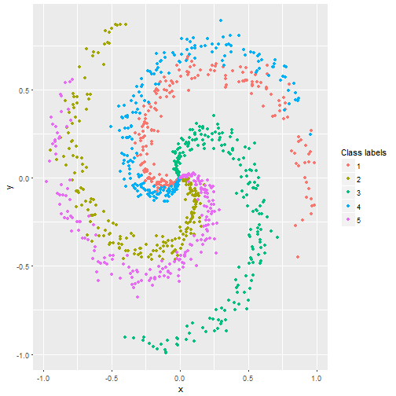

--- 
title       : Developing Data Products
subtitle    : Week 4 course work
author      : Matti Niemisto
job         : 
framework   : io2012        # {io2012, html5slides, shower, dzslides, ...}
highlighter : highlight.js  # {highlight.js, prettify, highlight}
hitheme     : tomorrow      # 
widgets     : []            # {mathjax, quiz, bootstrap}
mode        : selfcontained # {standalone, draft}
knit        : slidify::knit2slides
--- .class-black #id2

## The Problem

1. The search for optimal Neural Network architecture can be really time consuming process.

2. Figuring out what topology to use can be a tedious process.

3. No fast and easy way exist how to test different alternatives.

--- .class-black #id3 

## Solution

Neural Network Architecture search tool

1. Fast and easy way to try out different topologies for a classification problem.

2. Parameter initialization and update during training handled automatically based on topology data.

3. Training error and accuracy plotted in a visual and informative way.

--- &twocol .class-black #id4

## Which topology would work well on this sample data?

*** =left


```r
library(pracma)
library(ggplot2)
set.seed(1234);
    points = 200;
    classes = 5;
    dimensionality = 2;
    # data matrix (each row = single example)
    X = matrix(rep(0), nrow = points*classes, ncol = dimensionality) 
    # class labels
    y = matrix(rep(0), nrow = points*classes, ncol = 1) 
    for (j in 1:classes) {
      ix = (points*(j-1)+1):(points*j)
      r = linspace(0.0,1,points) # radius
      t = linspace(j*4,(j+1)*4,points) + randn(1,points) * 0.2 # theta
      X[ix,] = matrix(data = c(r*sin(t), r*cos(t)), ncol = 2)
      y[ix,] = j
    }
    df <- as.data.frame(cbind(X,y))
    colnames(df) <- c("x", "y", "Label")
    p <- ggplot(df, aes(x = x, y = y, color = as.factor(Label))) +
      geom_point() +
      labs(color='Class labels') 
```

*** =right



---  .class-black #id5

## Try my Neural Network search tool for insights

Try different topologies in fast and easy manner.

Download the source code from GitHub and try with your own data.

Visit my shiny app at https://mattiniemisto.shinyapps.io/DDPCWMatti/

# Thank You!

